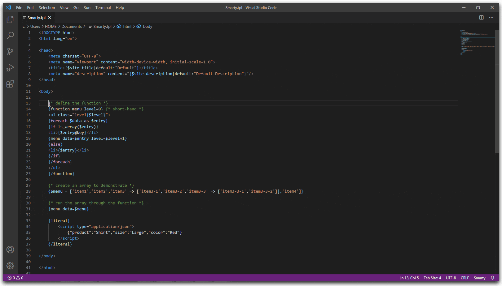
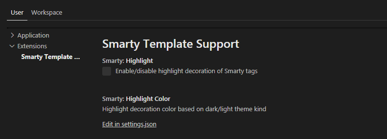
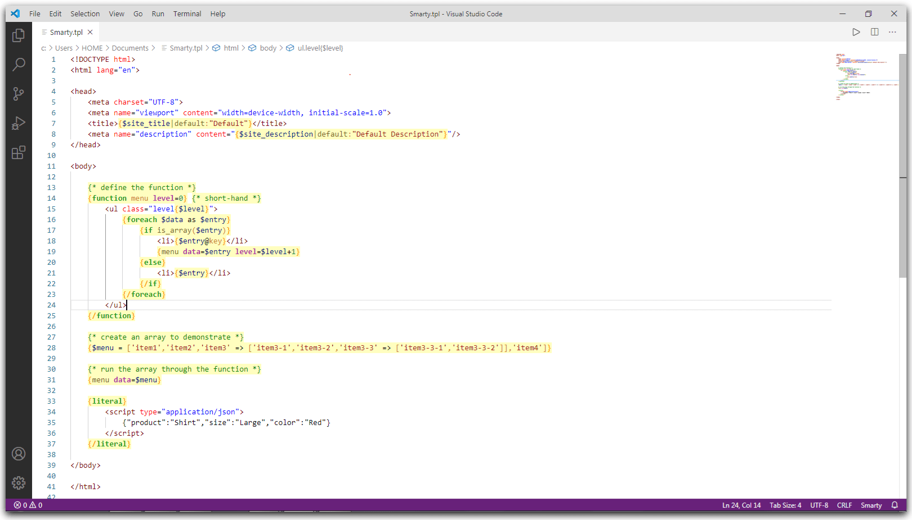

# Smarty Template for Visual Studio Code

[](https://marketplace.visualstudio.com/items?itemName=aswinkumar863.smarty-template-support)
[](https://marketplace.visualstudio.com/items?itemName=aswinkumar863.smarty-template-support)
[](https://marketplace.visualstudio.com/items?itemName=aswinkumar863.smarty-template-support#review-details)


Provides [Smarty Template](https://www.smarty.net/) support to Visual Studio Code.

## Features

* Syntax highlighting
* Snippet completion
* Code formatting
* Code folding
* Comment toggling
* Bracket autoclosing
* Bracket autosurrounding
* Hover documentation
* Auto Indentation

## What it looks like



## Requirements

* VS Code `1.43.0` or higher

## Extension Settings




* **`smarty.highlight`**: Enable/disable highlight decoration of smarty tags documents.
* **`smarty.highlightColor`**: Highlight decoration color based on dark/light theme kind.

**For example:**

```
"smarty.highhlight": true,
"smarty.highlightColor": {
    "dark": "#FFFFFF25",
    "light": "#FFFA0040"
}
```

## User Settings

**For Emmet Abbreviations:**

Paste the following into your `settings.json`

```
"emmet.includeLanguages": {
  "smarty": "html"
}
```

**For Netbeans Style Theme:**



Paste the following into your `settings.json`

```
"editor.tokenColorCustomizations": {
    "textMateRules": [
        {
            "scope": [
                "punctuation.section.embedded.begin.smarty",
                "punctuation.section.embedded.end.smarty"
            ],
            "settings": {
                "foreground": "#FFA500",
                "fontStyle": "bold"
            }
        },
        {
            "scope": [
                "keyword.control.smarty",
                "support.function.built-in.smarty"
            ],
            "settings": {
                "foreground": "#16A016",
                "fontStyle": "bold"
            }
        },
        {
            "scope": ["variable.parameter.smarty"],
            "settings": {
                "foreground": "#AE23A3",
                "fontStyle": "bold"
            }
        },
        {
            "scope": ["source.smarty"],
            "settings": {
                "foreground": "#D17C32"
            }
        }
    ]
}
```

## Known Issues

Due to the formatter is HTML based, code formatting applies only to `HTML/CSS/JS` of document.

Submit the [issues](https://github.com/aswinkumar863/smarty-vscode-support/issues) if you find any bug or have any suggestion.

## Release Notes

Detailed release notes are available [here](CHANGELOG.md).

